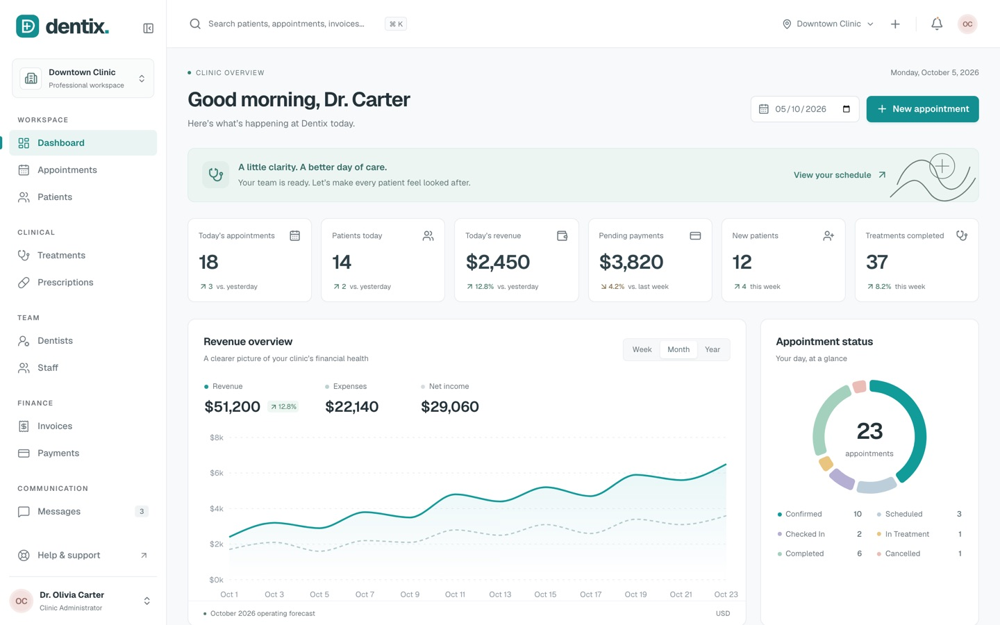

# Dentix Lite — free Next.js dental clinic dashboard

**Dental care, beautifully organized.** A free, open-source admin dashboard for dental clinics, built with Next.js 16, React 19, TypeScript and Tailwind CSS v4.

**[Live demo of the full version →](https://dentix-mu.vercel.app)** · **[Get Dentix Pro →](https://beaj5.gumroad.com/l/dentix)**



## What's in Lite

- **Clinic dashboard:** KPIs, revenue overview chart, appointment status, today's schedule, dentist workload, outstanding payments, activity and patient alerts
- **Patient directory:** TanStack Table with search, filters, sorting, column visibility, row selection, bulk actions, pagination and CSV export
- **App shell:** collapsible sidebar, mobile navigation drawer, command palette (⌘/Ctrl K), notifications, booking dialog, toasts, loading skeletons, empty states, 404 and error pages
- **Demo login** and typed, connected demo data

## Lite vs Pro

|                                                                  | Lite (free) | [Pro](https://beaj5.gumroad.com/l/dentix) |
| ---------------------------------------------------------------- | :---------: | :---------------------------------: |
| Dashboard, patient directory, app shell                          |      ✓      |                  ✓                  |
| Patient workspace with medical history, files, billing and notes |             |                  ✓                  |
| Interactive dental chart (odontogram)                            |             |                  ✓                  |
| Day / week / month appointment calendar                          |             |                  ✓                  |
| Dentists, staff, treatments, prescriptions                       |             |                  ✓                  |
| Invoices with PDF export, payments analytics                     |             |                  ✓                  |
| Patient inbox with SMS/email templates                           |             |                  ✓                  |
| Reports with CSV export, clinic settings                         |             |                  ✓                  |
| HTML documentation and email support                             |             |                  ✓                  |
| License                                                          |     MIT     |             Commercial              |

Pro screens appear in Lite's sidebar with a **PRO** badge and open a preview that links to the same screen in the live demo.

## Getting started

Requires Node.js 22.13+.

```bash
npm install
npm run dev
```

Open http://localhost:3000.

```bash
npm run build      # production build
npm run lint       # ESLint
npm run typecheck  # TypeScript
npm test           # unit tests
npm run test:e2e   # Playwright browser tests (run `npx playwright install chromium` first)
```

## Tech stack

Next.js 16 (App Router) · React 19 · TypeScript (strict) · Tailwind CSS v4 · Radix UI · Recharts · TanStack Table · React Hook Form · Zod · date-fns · Lucide icons · Geist font

## Customizing

- **Colors:** CSS custom properties at the top of `src/app/globals.css`
- **Logo:** `Logo` in `src/components/ui/primitives.tsx` and `src/app/icon.svg`
- **Demo data:** typed records in `src/data/`
- **Backend:** replace the seed data and mutations in `src/hooks/use-clinic.tsx` with your API

This is a frontend template with fictional data. It has no backend, real authentication or compliance certification.

## License

MIT. See `LICENSE`. Third-party packages keep their own licenses; see `THIRD_PARTY_NOTICES.md`.
